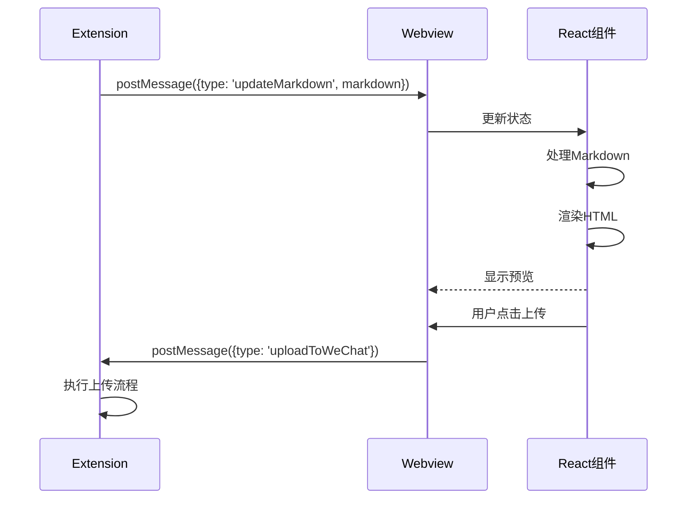
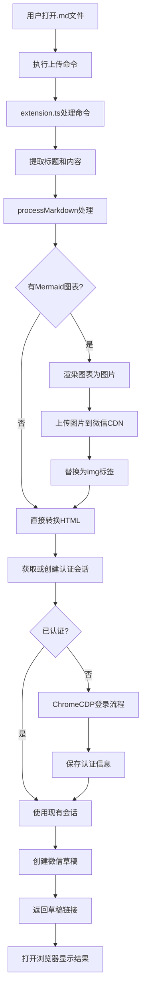
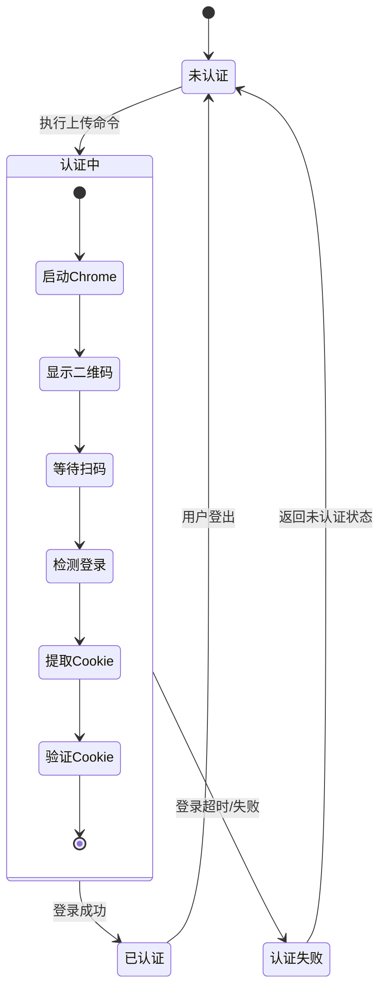
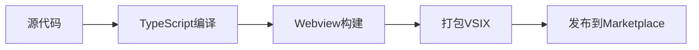

# WeChatPost 架构文档

## 项目概述

WeChatPost 是一个 Visual Studio Code 扩展，用于将 Markdown 文件一键发布到微信公众号。它支持 Mermaid 图表自动渲染上传，并采用 Chrome CDP（Chrome DevTools Protocol）实现全自动登录和发布流程。

### 核心功能
- ✅ 完整支持 Markdown / GFM（GitHub Flavored Markdown）
- ✅ 支持 Mermaid 图表自动渲染上传
- ✅ 代码高亮（highlight.js）
- ✅ 默认微信样式主题
- ✅ 手机扫码登录（不需要开发者资质/AppID）
- ✅ 一键发布到公众号草稿箱
- ✅ 自动上传所有图片到微信 CDN
- ✅ VSCode 安全存储认证信息

## 系统架构

### 整体架构图

```mermaid
graph TB
    subgraph "VSCode 扩展层"
        A[VSCode Extension] --> B[Extension.ts]
        B --> C[Services]
        B --> D[Utils]
        B --> E[Webview]
    end
    
    subgraph "服务层"
        C --> F[WeChatService]
        C --> G[ChromeCDPService]
        C --> H[PreviewService]
        C --> I[SettingsService]
    end
    
    subgraph "工具层"
        D --> J[processMarkdown.ts]
        D --> K[mermaidRenderer.ts]
        D --> L[extractTitle.ts]
    end
    
        E --> M[React App]
        M --> N[Preview Component]
        M --> O[Toolbar Component]
    end
    
    F --> P[WeChat API]
    G --> Q[Chrome Browser]
    
    style A fill:#e1f5fe
    style C fill:#f3e5f5
    style D fill:#e8f5e8
    style E fill:#fff3e0
```

### 组件详细说明

#### 1. 扩展入口点 (`src/extension.ts`)
- **职责**: 扩展激活、命令注册、服务初始化
- **关键功能**:
  - 注册三个主要命令：`wechatpost.preview`, `wechatpost.uploadToWeChat`, `wechatpost.logoutWeChat`
  - 初始化所有服务实例
  - 处理 CDP 全自动上传流程
  - 管理认证状态

#### 2. 服务层 (Services)

##### 2.1 WeChatService (`src/services/WeChatService.ts`)
- **职责**: 处理与微信公众号 API 的所有交互
- **关键功能**:
  - 认证管理（保存/加载 Cookie）
  - 图片上传到微信 CDN
  - 创建文章草稿
  - 验证用户身份
- **接口定义**:
  ```typescript
  interface IWeChatService {
    checkAuth(): Promise<{ isAuthenticated: boolean; authInfo?: WeChatAuthInfo }>;
    checkAuthWithCookies(cookies: CookieParam[]): Promise<{ isAuthenticated: boolean; authInfo?: WeChatAuthInfo }>;
    uploadImage(buffer: Buffer, filename: string): Promise<WeChatUploadResult>;
    createDraft(title: string, author: string, content: string): Promise<WeChatDraftResult>;
  }
  ```

##### 2.2 ChromeCDPService (`src/services/ChromeCDPService.ts`)
- **职责**: 通过 Puppeteer 控制 Chrome 浏览器实现自动化
- **关键功能**:
  - 首次登录流程（显示二维码）
  - 已认证会话管理
  - Cookie 提取和注入
  - 自动发布草稿
- **工作流程**:
  ```mermaid
  sequenceDiagram
    participant U as 用户
    participant C as ChromeCDPService
    participant B as Chrome浏览器
    participant W as WeChat网页
    
    U->>C: 执行上传命令
    C->>B: 启动浏览器
    B->>W: 导航到 mp.weixin.qq.com
    W-->>U: 显示二维码
    U->>W: 手机扫码登录
    C->>W: 检测登录状态
    W-->>C: 返回Cookie
    C->>C: 保存认证信息
    C->>W: 自动创建草稿
    W-->>C: 返回草稿链接
    C-->>U: 显示成功消息
  ```

##### 2.3 PreviewService (`src/services/PreviewService.ts`)
- **职责**: 管理 Markdown 预览 Webview
- **关键功能**:
  - 创建和显示预览面板
  - 与 Webview 通信
  - 更新认证状态显示

##### 2.4 SettingsService (`src/services/SettingsService.ts`)
- **职责**: 管理扩展配置
- **关键功能**:
  - 读取/写入 VSCode 配置
  - 管理默认作者名等设置

#### 3. 工具层 (Utils)

##### 3.1 processMarkdown (`src/utils/processMarkdown.ts`)
- **职责**: 处理 Markdown 转换为微信兼容的 HTML
- **关键功能**:
  - 使用 unified 处理 Markdown
  - 渲染 Mermaid 图表为图片
  - 处理代码高亮
- **处理流程**:
  ```mermaid
  graph LR
    A[原始Markdown] --> B{检测Mermaid图表}
    B -->|有图表| C[渲染为图片]
    B -->|无图表| D[直接处理]
    C --> E[上传到微信CDN]
    E --> F[替换为img标签]
    D --> G[Markdown转HTML]
    F --> G
    G --> H[代码高亮]
    H --> I[最终HTML]
  ```

##### 3.2 mermaidRenderer (`src/utils/mermaidRenderer.ts`)
- **职责**: 将 Mermaid 代码渲染为图片
- **关键功能**:
  - 使用 jsdom 和 canvas 渲染图表
  - 支持多种图表类型
  - 生成 PNG 格式图片

##### 3.3 extractTitle (`src/utils/extractTitle.ts`)
- **职责**: 从 Markdown 中提取文章标题
- **规则**: 使用第一个一级标题作为文章标题


##### 4.1 React 应用结构
```
webview-src/
├── src/
│   ├── App.tsx              # 主应用组件
│   ├── main.tsx             # 入口点
│   ├── components/          # 组件目录
│   │   ├── Preview.tsx      # 预览组件
│   │   └── Toolbar.tsx      # 工具栏组件
│   ├── hooks/               # 自定义钩子
│   │   └── useMarkdownProcessor.ts
│   ├── plugins/             # Remark 插件
│   │   └── remarkMermaid.ts
│   ├── styles/              # 样式文件
│   └── types/               # 类型定义
```

##### 4.2 通信机制


## 数据流

### 上传流程数据流


### 认证状态管理


## 技术栈

### 后端/扩展端
- **语言**: TypeScript
- **运行时**: Node.js (VSCode 扩展环境)
- **核心库**:
  - `puppeteer`: Chrome 浏览器自动化
  - `unified`: Markdown 处理管道
  - `jsdom` + `canvas`: Mermaid 图表渲染
  - `node-fetch`: HTTP 请求
  - `form-data`: 文件上传

### 前端/Webview端
- **框架**: React 18
- **构建工具**: Vite
- **UI 库**: Ant Design 5
- **Markdown 处理**: Remark/Rehype 生态系统

### 开发工具
- **测试**: Jest + ts-jest
- **类型检查**: TypeScript
- **代码质量**: ESLint (假设)

## 配置管理

### VSCode 配置项
```json
{
  "wechatPublisher.defaultAuthor": {
    "type": "string",
    "default": "",
    "description": "Default author name used when creating a WeChat draft."
  },
  "wechatPublisher.autoOpenDraftAfterPublish": {
    "type": "boolean",
    "default": true,
    "description": "Automatically open the created WeChat draft in the browser after upload."
  }
}
```

### 安全存储
- **存储位置**: VSCode Secret Storage
- **存储内容**: 微信认证信息 (Cookie, token, ticket 等)
- **密钥**: `wechat-publisher.auth`

## 错误处理

### 错误分类
1. **网络错误**: 微信 API 调用失败、CDP 连接失败
2. **认证错误**: Cookie 失效、登录失败
3. **处理错误**: Markdown 处理失败、图片渲染失败
4. **用户错误**: 无活动编辑器、文件格式错误

### 错误处理策略
- **重试机制**: 网络错误自动重试
- **降级方案**: Mermaid 渲染失败时保留原始代码块
- **用户反馈**: 通过 VSCode 通知和输出通道提供详细错误信息
- **日志记录**: 详细的日志记录到输出通道

## 性能考虑

### 优化措施
1. **Chrome 会话复用**: 保持浏览器会话避免重复启动
2. **图片缓存**: 已上传图片不再重复上传
3. **增量处理**: 仅处理变化的 Mermaid 图表
4. **异步操作**: 所有耗时操作都使用异步处理

### 资源管理
- **内存**: 及时释放图片 buffer
- **进程**: 正确关闭 Chrome 进程
- **存储**: 定期清理临时文件

## 扩展性设计

### 插件系统
当前已支持 Mermaid 图表插件，架构设计允许轻松添加新的 Markdown 处理器插件。

### 服务接口
基于接口的设计使得可以替换不同的微信服务实现（如测试 Mock 实现）。

### 配置驱动
通过配置项控制行为，无需修改代码即可调整功能。

## 测试策略

### 单元测试
- 服务层独立测试
- 工具函数测试
- 接口契约测试

### 集成测试
- Chrome CDP 集成测试（使用 Playwright）
- 微信 API 集成测试（Mock 实现）

### 端到端测试
- VSCode 扩展命令测试
- 完整发布流程测试

## 部署与发布

### 构建流程


### 版本管理
- 遵循语义化版本控制
- 通过 GitHub Actions 自动化发布
- 维护 CHANGELOG.md 记录变更

## 未来扩展方向

### 计划功能
1. **多平台支持**: 除微信公众号外的其他平台
2. **批量处理**: 一次上传多篇文章
3. **模板系统**: 自定义文章模板
4. **图片优化**: 自动压缩和优化图片
5. **协作功能**: 团队协作和审核流程

### 技术改进
1. **Webview 性能优化**: 虚拟滚动支持长文档
2. **离线支持**: 本地缓存和离线编辑
3. **AI 集成**: 自动摘要和标签生成

## 总结

WeChatPost 采用分层架构设计，各组件职责清晰，通过服务接口解耦。核心价值在于将复杂的微信发布流程自动化，同时提供良好的开发体验和用户界面。架构设计考虑了扩展性、可维护性和性能，为未来功能扩展奠定了良好基础。

本架构文档提供了项目的全面视图，包括组件关系、数据流、技术决策和设计原则，可作为新开发者了解项目和后续开发的基础参考。